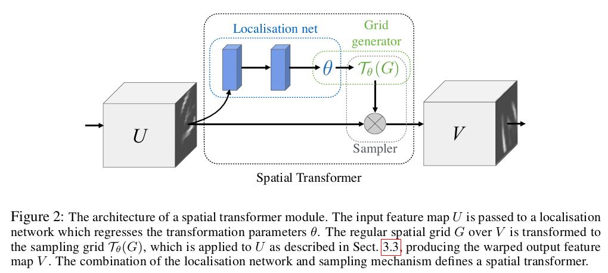
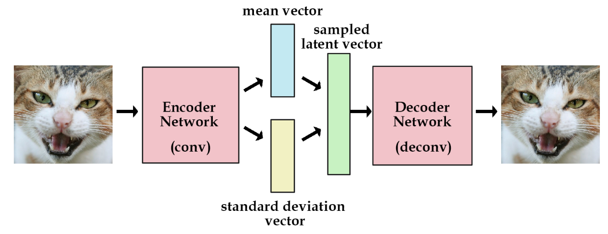
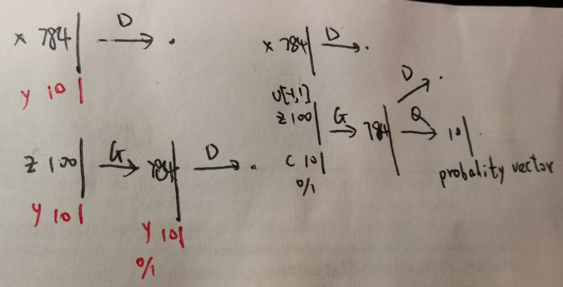
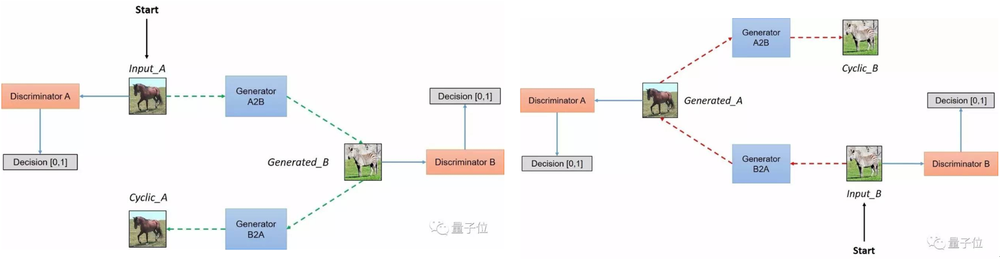
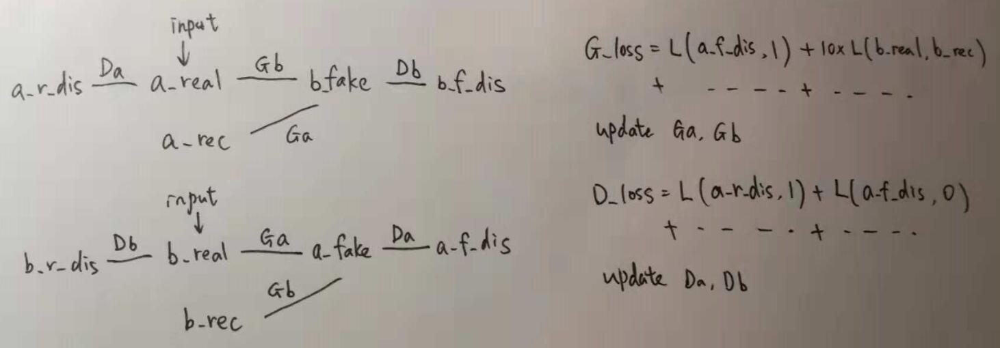
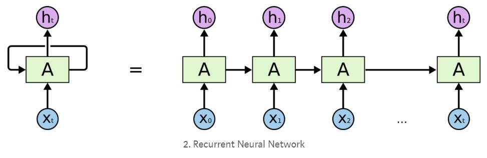
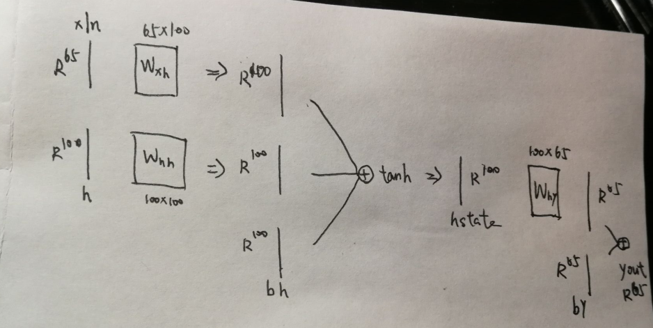
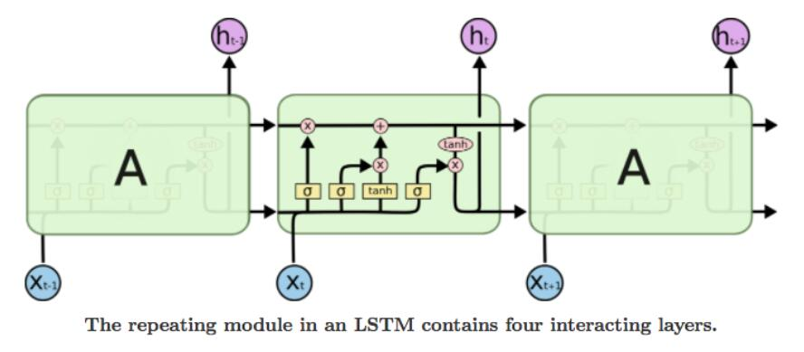
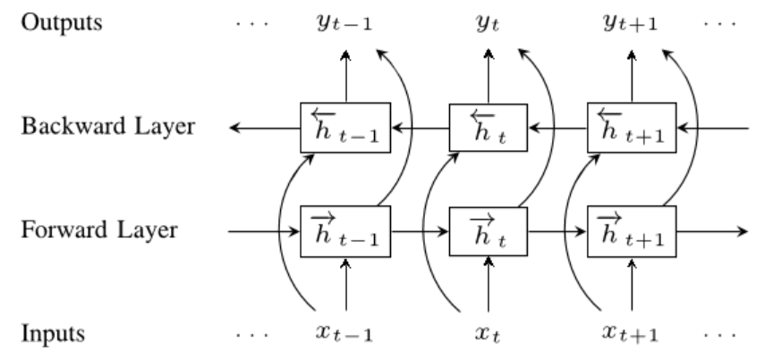

# TorchFlow
Some implementations using Pytorch and Tensorflow.

## API

### Tensorflow
In VAE and GAN (except CycleGAN), we use `tf.Variable` to construct weights explicitly. We only use `tf.matmul` to define layers, `tf.nn.sigmoid`, `tf.nn.relu` or `tf.nn.softmax` to make activations. For CNN, we use `tf.nn.conv2d`. 

The advantage of just using tf base functions is that when updating a subset of weights, we can use
```python
w1=tf.Variable()
w2=tf.Variable()
theta_some = [w1, w2]

solver = tf.train.AdamOptimizer().minimize(loss, var_list=theta_some)
```

In comparison, in CycleGAN and RNN, we don't define weights ourselves. **We use `tf.layers.dense`, `tf.layers.conv2d` for CNN and 
`tf.nn.rnn_cell` \& `tf.nn.static_rnn` for RNN.**

If we want to update a subset of weights, we need to state layers' names.

### Pytorch
In VAE and GAN (except CycleGAN), we use `torch.zeros` or `torch.randn` to construct weights explicitly. We only use `torch.nn.functional.linear` to define layers, `torch.relu`, `torch.sigmoid` or `torch.softmax` to make activations.

For loss, we use `torch.nn.CrossEntropyLoss` (using `logits`) or `F.binary_cross_entropy` (using `sigmoid(logits)`).

In comparison, in CycleGAN, RNN and CNN, we don't define weights ourselves. **We use `torch.nn.Conv2d` \& `torch.nn.MaxPool2d` for CNN, 
`nn.Linear` for MLP, `nn.RNN` for RNN. Here, we can use several Class inherit from `nn.module` and update weights easily.**
```python
class Net(nn.Module):
    def __init__(self):
        super(Net, self).__init__()
        self.conv1 = nn.Conv2d(3, 6, 5)
        self.pool = nn.MaxPool2d(2, 2)
        self.conv2 = nn.Conv2d(6, 16, 5)
        self.fc1 = nn.Linear(16 * 5 * 5, 120)
        self.fc3 = nn.Linear(120, 10)

    def forward(self, x):
        x = self.pool(torch.relu(self.conv1(x)))
        x = self.pool(torch.relu(self.conv2(x)))
        x = x.view(-1, 16 * 5 * 5)
        x = torch.relu(self.fc1(x))
        x = self.fc3(x)
        return x
        
net = Net()

criterion = nn.CrossEntropyLoss()
optimizer = optim.SGD(net.parameters(), lr=0.001, momentum=0.9)

for i, data in enumerate(trainloader):
    inputs, labels = data
    optimizer.zero_grad()
    outputs = net(inputs)
    loss = criterion(outputs, labels)
    loss.backward()
    optimizer.step()
```

## CNN
1. [cifar10] (PT)
2. [spatial transformer] (PT)
3. [transfer learning] (PT)

### cifar10:
In this pytorch official tutorial, we emphasis on `DataLoader`, CNN structure, `torch.no_grad()` in test step and GPU usage.

key code:
```python
# The output of torchvision datasets are PILImage images of range [0, 1]. We transform them to Tensors of normalized range [-1, 1].
transform = transforms.Compose( [transforms.ToTensor(),
                                transforms.Normalize((0.5, 0.5, 0.5), (0.5, 0.5, 0.5))])

# set `num_workers=0` for windows user. Or error: BrokenPipeError: [Errno 32] Broken pipe. See: https://github.com/pytorch/pytorch/issues/2341
trainset = torchvision.datasets.CIFAR10(root='./data', train=True, download=True, transform=transform)
trainloader = torch.utils.data.DataLoader(trainset, batch_size=4, shuffle=True, num_workers=0)

# get some random training images
dataiter = iter(trainloader)
images, labels = dataiter.next()

class Net(nn.Module):

net = Net()

# test step
with torch.no_grad():
    for data in testloader:
        images, labels = data
        outputs = net(images)
        #...
```

### Spacial Transformer Network (STN):

STN allow a neural network to learn how to perform spatial transformations on the input image in order to enhance the geometric
invariance of the model.

For example, it can crop a region of interest, scale and correct the orientation of an image. It can be a useful mechanism because CNNs
are not invariant to rotation and scale and more general affine transformations.

So, if images scale or rotate a lot, CNN can't learn well. Use STN. STN can not only add accuracy but also use as generative model: we can show figures (sampler) after scaled and rotated.

One of the best things about STN is the ability to simply plug it into any existing CNN with very little modification.



**We don't know the correct ground truth of the rotation and scaling, we use a NN (localizaiton) to learn and it works well!**

#### Flow:
1. input: x: [64, 1, 28, 28] (figure), label: [64]. batch_size=64.
2. Spatial transformer localization-network: `xs=localization(x)`: [64, 1, 28, 28] -> [64, 10, 3, 3]. (Conv2d+MaxPool2d+ReLU)*2.
3. Regressor for the 3 * 2 affine matrix: `theta=fc_loc(xs.view(-1, 10*3*3)).view(-1, 2, 3)`.
    fc_loc: [64, 10\*3\*3] -> [64, 32\*3\*2]. (Linear+ReLU+Linear).
4.  grid generator \& sampler: `x = F.grid_sample(x, F.affine_grid(theta, x.size()) )`. [64, 32\*3\*2] -> [64, 1, 28, 28].
5. ordinary CNN: `x=CNN(x)`, loss and train step.

We look closer to the structure.

In localization, we have input: [64, 1, 28, 28] (consider [28,28] instead). Each point in figure is a coordinate (x,y)' (1<=x<=28).
We use affine transformation: (xs,ys)'=[theta; 2\*3 matrix]\*(xt,yt,1)' to represent all the transformation. xt is target (output) while xs is sourse (input).

Now, we learn theta from a NN and we can get coordinate (xt,yt). However, this coordinate is not integer. So we use kernel to represent distance of the non-integer coordinate and all the interger grid coordinate.


Here, Umnc is the input at location (m,n) in channel c, Vic is the output at location (xit,yit).

One note about Class `nn.module`. If we use `F.dropout` or batchnorm, which acts differently in train and test step, we can do this:
```python
class Net(nn.Module):
    def __init__(self):
        super(Net, self).__init__()
        ...
    def forward(self, x):
        x = F.dropout(x, training=self.training)
        ...
model = Net()

#train
model.train()
#update

#test
with torch.no_grad():
    model.eval()
    #test
```
### Transfer learning:
In practice, very few people train an entire Convolutional Network from scratch (with random initialization), because it is relatively rare to have a dataset of sufficient size. Instead, it is common to pretrain a ConvNet on a very large dataset and then use the ConvNet either as an initialization or a fixed feature extractor for the task of interest.

In this tutorial, we focus on:

First, learning rate decay in several round.
```python
from torch.optim import lr_scheduler

# Decay LR by a factor of 0.1 every 7 epochs
exp_lr_scheduler = lr_scheduler.StepLR(optimizer_ft, step_size=7, gamma=0.1)
# train step
for epoch in range(num_epochs):
    exp_lr_scheduler.step()
```
Second, fine tune the model. If we want to fix weights of the upper layers, we can set these weights to `requires_grad=F`.
```python
from torchvision import models

model_ft = models.resnet18(pretrained=True)
num_ftrs = model_ft.fc.in_features

model_ft.fc
# Linear(in_features=512, out_features=1000, bias=True)

# change the last layer to outfeatures=2 to realize fine tune
model_ft.fc = nn.Linear(num_ftrs, 2)
```

Third, methods and attributes of class `nn.module`.
``` python
model_ft = models.resnet18(pretrained=True)
# get specific layer's structure
model_ft.fc
# get this layer's parameter
model_ft.fc.in_features
# get this layer's current weigths
model_ft.fc.weight
model_ft.fc.bias
# get all weights and bias
list(model_ft.parameters())
model_ft.state_dict()
# get training mode or eval mode
model_ft.training
# True
```

## Variational Autoencoder (VAE)
1. [Vanilla VAE](https://arxiv.org/abs/1312.6114)
2. [Conditional VAE](https://arxiv.org/abs/1406.5298)

VAE is the simplest Generative Model. It learns `mean` and `log_sd` of the latent variable. After the model is built, we may generate samples from a Normal distribution. The Conditional VAE has labels as the input and we can generate samples fixing the specific label.

The codes are based on original papers and wiseodd/generative-models, however, I make some improvements:
1. I try to make both Pytorch and Tensorflow's code similarly to each other.
2. Both codes are as simple and concise as possible (don't use argparse or some fancy utils).
3. Both codes are updated to the latest version (TF: API r1.12, PT: Version 1.0 (`Variable` is deprecated)).
4. Since it is used for self learning, I don't use higer API (such as keras, eager, layer) and I specify weights explicity, so it is more understandable.

### Model structure of VAE:
- Mean: dimension flow: 784->128->100, relu+linear
- Logvar: dimension flow: 784->128->100, relu+linear
- Q(z|X): sample z~N(mean,var). [batch, 100]
- P(X|z): dimension flow: 100->128->784, relu+sigmod
- LOSS=E[log P(X|z)]+KL(Q(z|X) || N(0,1)). First loss is ordinary cross entrophy

Model structure of VAE:



### Model structure of CVAE:
- Mean: dimension flow: 784+10->128->100, relu+linear
- Logvar: dimension flow: 784+10->128->100, relu+linear
- Q(z|X): sample z~N(mean,var). [batch, 100]
- P(X|z): dimension flow: 100+10->128->784, relu+sigmod
- LOSS=E[log P(X|z)]+KL(Q(z|X) || N(0,1)). First loss is ordinary cross entrophy
- We set x and y as the input. CVAE can both predict a figure and generate selected label's figure


## Generative Adversarial Nets (GAN)
1. [Vanilla GAN](https://arxiv.org/abs/1406.2661)
2. [Conditional GAN](https://arxiv.org/abs/1411.1784)
3. [InfoGAN](https://arxiv.org/abs/1606.03657)
4. [Cycle GAN](https://arxiv.org/pdf/1703.10593.pdf)

GAN trains a discriminator and generator, which is adversarial. Generator G(z) tries to generate from noise z to the same distribution of X, while discriminator (\in [0,1]) tries to discriminate them.

The codes are based on original papers and wiseodd/generative-models, however, I make some improvements:
1. I try to make both Pytorch and Tensorflow's code similarly to each other.
2. Both codes are as simple and concise as possible (don't use argparse or some fancy utils).
3. Both codes are updated to the latest version (TF: API r1.12, PT: Version 1.0 (`Variable` is deprecated)).
4. Since it is used for self learning, I don't use higer API (such as keras, eager, layer) and I specify weights explicity, so it is more understandable. However, because it is too complicated in CycleGAN, I use `torch.nn` and `tf.nn` to build layers.

### Model structure of GAN:
- Discriminator: dimension flow: 784->128->1, relu+sigmod
- Generator: dimension flow: 100->128->784, relu+sigmod
- Use xavier to init weights; use U(-1,1) to init z
- DLOSS=`binary_cross_entropy(D_real, ones_label)+binary_cross_entropy(D_fake, zeros_label)`
- GLOSS=`binary_cross_entropy(D_fake, ones_label)`

### Model structure of CGAN:
- Discriminator: dimension flow: 784+10->128->1, relu+sigmod
- Generator: dimension flow: 100+10->128->784+10, relu+sigmod
- Use xavier to init weights; use U(-1,1) to init z
- We set x and y as the input. CVAE can both predict a figure and generate selected label's figure

### Model structure of InfoGAN:

Since in GAN, there is no restriction in z, which may hard for us to use the information. In infoGAN, we seperate z into random z and latent c. c can be categorical (Mulcat(10) to stand for labels 0-9) or continuous (Normal to stand for incline or width).

In LOSS, we add a Mutual Information regularization term: I(c || G(c,z)). Because c and G(c,z) should have high correlation.

However, because this regularization need posterior P(c|X), which is hard to get, we use Q(c,x) to approximate.

- Discriminator: dimension flow: 784->128->1, relu+sigmod
- Generator: dimension flow: 16+10->256->784, relu+sigmod
- Q:--------------------------------------------784->128->10, relu+softmax
- Use xavier to init weights; use U(-1,1) to init z (z:[batch,16]); use N(1,1) to init c (c:[batch,10])
- c may control the width or incline; Mulcat(10) of c may stand for labels
- QLOSS=E(P(Q(G_sample)|c))

Model structure of GANs: (left is GAN, left+red is CGAN, right is InfoGAN)



### Model structure of CycleGAN:
In CycleGAN, we have two datasets and we don't need to sample noise z.




Exemplar results on testset: horse -> zebra


## Recurrent Neural Network (RNN)
1. [Classifying names from languages] (PT)
2. [Generating names from languages] (PT)
3. [Predicting hand-written number] (TF)
4. [Generating shakespeares play] (TF)

RNN trains a hidden state (in LSTM trains several gates and cell state) and in each sequence (time step), we use both input and current hidden state to compute the next state. After that, we use a linear network to convey hidden state into output.

**The difference between RNN and MLP is that it is dependent between sequence (time step).**

In the first and third examples, we see that RNN can also make **prediction**. We can predict a category after reading in all the letters of a name, and use the last time step (sequence) output to calculate cross-entrophy loss.

We need to sum the loss of each sequence in example 2 & 4, which is more commplicated and different from above examples.

The first two models are based on [Pytorch tutorial](https://pytorch.org/tutorials/intermediate/char_rnn_classification_tutorial.html), however, I make some improvements:
1. I try to make both Pytorch and Tensorflow's code similarly to each other.
2. Both codes are as simple and concise as possible (don't use argparse or some fancy utils).
3. Both codes are updated to the latest version (TF: API r1.12, PT: Version 1.0 (`Variable` is deprecated)).
4. In original Pytorch tutorial, the author defines RNN himself. However, I use `torch.nn.RNN`, which is more understandable.

### Model structures
Following figures are model structures of RNN, LSTM and Bidirectional-RNN.





### Classifying names from languages (PT)
Given a name, we can predict the language used:
```python
$ python predict.py Schmidhuber
    (-0.19) German
    (-2.48) Czech
    (-2.68) Dutch
```
#### Flow:
1. Dataset: included in the ``data/names`` directory are 18 text files named as
"[Language].txt". Each file contains a bunch of names, one name per
line, mostly romanized (but we still need to convert from Unicode to
ASCII).
2. Input: In each round, one word (eg: `Hinton`), one output (`Scottish`).
3. `Hinton`:[seq=6, batch=1, input_dim=57] -> hidden:[seq=6, batch=1, hid_dim=128].
Then we use hidden[-1,:,:] to do linear network -> output:[1,18].
Finally, we use output and `Scottish`[1,18] (one hot) to compute loss.

**Note that in each time step, we feed in Hinton[i,:,:] to get hidden [i,:,:].**

**Note that hidden[-1,:,:] is the last time step, which can be regard as information we learnt from all the sequence (6 time step).**

We use batch=1, input_dim=57 (totally 57 characters in vocabulary dictionary),
hidden_dim=128, output_dim=18 (totally 18 languages which we want to classify).
eg: for word `Hinton`, seq=6 (6 characters in word `Hinton`).

We see that RNN can also make **prediction**. We can predict a category after reading in all the letters of a name, and use the last time step (sequence) output to calculate cross-entrophy loss.

Key codes:
```python
class RNN(nn.Module):
    def __init__(self, input_dim, hidden_dim, layer_dim, output_dim):
        super(RNN, self).__init__()
        
        self.hidden_dim = hidden_dim
        self.layer_dim = layer_dim
        self.input_dim = input_dim
        self.output_dim = output_dim
        self.rnn = nn.RNN(self.input_dim, self.hidden_dim, self.layer_dim, nonlinearity='relu')
        self.fc = nn.Linear(self.hidden_dim, self.output_dim)
    
    def forward(self, x):
        out, _ = self.rnn(x)
        out = self.fc(out[-1,:, :]) 
        return out
        
rnn = RNN(n_letters, n_hidden, 1,n_categories)
optimizer=optim.SGD(rnn.parameters(),lr=0.005)
criterion = nn.CrossEntropyLoss()

for iter in range(1, n_iters + 1):
    category, line, category_tensor, line_tensor = randomTrainingExample()
    optimizer.zero_grad()
    output = rnn(line_tensor)
    # line_tensor shape:(seq_len, batch, input_size); output shape:  (seq_len, batch, output_size)
    
    loss = criterion(output, category_tensor)
    loss.backward()
    optimizer.step()
``` 
### Generating names from languages (PT)
Generate names. [failed, I don't know why... Maybe because I forget to concate language with input, but if I only use Chinese language, it still not learnt]

#### Flow:
1. Dataset: included in the ``data/names`` directory are 18 text files named as
"[Language].txt". Each file contains a bunch of names, one name per
line, mostly romanized (but we still need to convert from Unicode to
ASCII).
2. Input: In each round, one word (eg: `Hinton`), one output (`intonEOS`). `EOS` means the end of word.
3. `Hinton`:[seq=6, batch=1, input_dim=59] -> hidden:[seq=6, batch=1, hid_dim=128].
4. Then we use hidden[i,:,:] to do linear network -> logit:[seq=6, batch=1, input_dim=59] (updating hidden each time step).
5. Finally, we use logit and output:[seq=6, batch=1, input_dim=59] to compute loss (sum of loss of each time step).
6. For generating step, given a language and a beginning letter `a` for example, put `a`:[1,1,59] in the model to get logit:[1,1,59] to get second letter. Repeat.

We use batch=1, input_dim=59 (totally 59 characters in vocabulary dictionary), hidden_dim=128.

### Predicting hand-written number (TF)

We set batch_size=64. Since a figure is 28\*28, we set seq=28 (each row of a figure) and input_dim=28. In this example, seq_length is fixed while in the above, seq depends on words.

#### Flow:
1. Input: In each round, 64 figures and their numbers.
2. [batch=64,seq=28, input_dim=28]-> (`tf.unstack`) 28@[batch=64,input_dim=28] -> hidden: 28@[batch=64, hid_dim=128].
Then we use hidden[-1] to do linear network -> output:[64,10].
Finally, we use output and number (one hot) to compute loss.

**Note that in each time step, we feed in input[i] to get hidden[i].**

**Note that hidden[-1] is the last time step, which can be regard as information we learnt from all the sequence (28 time steps).**

Key codes:
```python
tf.reset_default_graph()
X = tf.placeholder("float", [None, timesteps, num_input])
Y = tf.placeholder("float", [None, num_classes])

X_list = tf.unstack(X, timesteps, 1)

lstm_cell = tf.nn.rnn_cell.BasicLSTMCell(num_hidden, forget_bias=1.0)
outputs, _ = tf.nn.static_rnn(lstm_cell, X_list, dtype=tf.float32)

logits = tf.layers.dense(outputs[-1], units=num_classes, activation=None,
                         kernel_initializer=tf.random_normal_initializer(seed=0))

loss_op = tf.reduce_mean(tf.nn.softmax_cross_entropy_with_logits(logits=logits, labels=Y))
optimizer = tf.train.GradientDescentOptimizer(learning_rate=learning_rate)
train_op = optimizer.minimize(loss_op)

correct_pred = tf.equal(tf.argmax(prediction, 1), tf.argmax(Y, 1))
accuracy = tf.reduce_mean(tf.cast(correct_pred, tf.float32))

init = tf.global_variables_initializer()

with tf.Session() as sess:
    sess.run(init)
    for step:
        batch_x, batch_y = mnist.train.next_batch(batch_size)
        batch_x = batch_x.reshape((batch_size, timesteps, num_input))
        _,loss=sess.run([train_op,loss], feed_dict={X: batch_x, Y: batch_y})
```

### Generating shakespeares play (TF)

The dataset is a period of shakespeares novel. We set batch=1, seq=25 (25 letters). We generate new chars after given the beginning of words.

#### Flow:
1. Input: (1,25,65). Totally 65 different chars in this novel. Output: (1,25,65), which is input moving forward a letter. eg: `Gaomin` is the input, then `aoming` is the output.
2. `tf.unstack` to 25@[1,65], then we RNN -> hidden: 25@[1,100].
3. In each hidden[i], we define linear network (reuse weight for all time step), to get logit: 25@[1,65].
4. We compute loss of logit: 25@[1,65] and output: 25@[1,65] (sum of all time step).
5. In train step, we use the current hidden state as the input hidden state in each epic (one epic: num of rounds that train all chars once), and then clear to 0 in next epic.
6. For test step, we first give 25 letters. Then each step, we choose the highest prob of the 26th letter. After that, we abandon the first letter and choose 2-26th letters as the input and repeat. We use current hidden state and reuse hidden-output as hidden-input.

**Note: here seq=25 is fixed. But we can set `seq` to be a `placeholder` to make it changeable in test part.**

## Word Embeddings

In RNN, we introduce the char-level input (every character is encoded into a vector). Now, each word is encoded into a number. We can turn this number into a vector by one-hot encoding, but the vocabulary size is too big and one-hot doesn't have Dristributed representation (mathematical vector property). Hence, we use NN to learn the latent word vector itself (embedding).

1. NGram (PT)
2. Skip-gram with negative sample (TF)
3. tag_word (PT)
4. seq2seq translation (PT)

We introduce several similar word2vec methods: NGram, CBOW and Skip-Gram.

Also, since vocabulary size is too big, using ordinary softmax (MLP) costs time. We introduce hierarchy tree and negative sampling to solve the problem.

In the third tutorial, we combine word embedding with LSTM model. Always, we use word embdding as the first layer.

### NGram (PT)
We introduce several similar word2vec methods: NGram, CBOW and Skip-Gram.

1. the text: "the brown quick fox jumped ..."
2. NGram with context size=2: ([the, brown], quick), ([brown, quick], fox), ...
3. CBOW with window size=1: ([the, quick], brown), ([brown, fox], quick), ([quick, jumped], fox), ... Learn word from context
4. Skip-Gram with window size=1: (brown, the), (brown, quick), (quick, brown), (quick, fox), ... Learn context from word
5. Turn all the words into a number \in [0, voc_size-1]

We define  `embedding_dim=10`, `batch_size=1`, `context_size=2`. There are totally 97 different words.

1. Input: size=2, eg: [0,2] (represents [the,quick]). Output: size=1.
2. Dimension flow: [2] -> (`nn.Embedding(97,10)`) [2,10] -> (`view((1, -1))`) [1,20] -> [1, 97] (linear+relu)*2.
3. Ordinary Crossentrophy Loss.

Here, `nn.Embedding(97,10)` has learnable parameter size=[97,10] to represent the embedding: from 97 to 10. Since input contex=2 (2 words), we choose these 2 words from 97 words, hence we get [2,10]. Actually, we can regard [2] as [2,97] if we onehot it. Thus, embedding just embed [2,97] into [2,10].

Key code for embedding:

```python
embedding = nn.Embedding(10, 3)
input = torch.LongTensor([[1,2,4,5],[4,3,2,9]])
# torch.Size([2, 4])
embedding(input).size()
# torch.Size([2, 4, 3])
```

After the model is learned, we can add following words. Also, the embedding matrix [97,10] learns some semantic meanings.

### Skip-gram with negative sample (TF)
Since vocabulary size is too big, using ordinary softmax (MLP) costs time. We introduce hierarchy tree and negative sampling to solve the problem.

Here, we use Skip-gram with size=1. Embed_size=2 (for better visualization). batch_size=20. num_sample=15 (number of negative examples). There are totally voc_size=35 different words.
Flow:

1. Input: [batch], output: [batch,1]. eg: x=[2,10,0], y=[[1],[11],[30]] if batch=3.
2. Compute NCE loss and update.

embeddings:[35,2], embed:[batch,2] (the same as PT before). NCE loss is binary logistic regression of 1 true and 15 false obervations.

Key code:

```python
x = tf.placeholder(tf.int32, shape=[batch_size])
y = tf.placeholder(tf.int32, shape=[batch_size, 1])

embeddings = tf.Variable(tf.random_uniform([voc_size, embedding_size], -1.0, 1.0))
embed = tf.nn.embedding_lookup(embeddings, x) # lookup table

# Construct the variables for the NCE loss
nce_weights = tf.Variable(tf.random_uniform([voc_size, embedding_size],-1.0, 1.0))
nce_biases = tf.Variable(tf.zeros([voc_size]))

loss = tf.reduce_mean(tf.nn.nce_loss(nce_weights, nce_biases, y, embed, num_sampled, voc_size))

train_op = tf.train.AdamOptimizer(1e-1).minimize(loss)

with tf.Session() as sess:
    tf.global_variables_initializer().run()
    for step in range(100):
        _, loss_val = sess.run([train_op, loss], feed_dict={x: batch_inputs, y: batch_labels})
    trained_embeddings = embeddings.eval()

# every word is a point in the embed figure
plot(trained_embeddings) 
```

### tag_word (PT)

Each sample of input is a sentence and its words' tags. eg: `("Everybody read that book".split(), ["NN", "V", "DET", "NN"])`.
We turn into numbers: `(tensor([5, 6, 7, 8]), tensor([1, 2, 0, 1]))`.

We set EMBEDDING_DIM = 6, HIDDEN_DIM = 16, vocab_size=9 (total 9 words), tagset_size=3 (total 3 tags), 

Dim flow:

1. input: [4] (if there are 4 words in this sentence) -> (`nn.Embedding(9,6)`) [4,6] -> (`view`) [4,1,6] (batch=1,seq=4)
2. LSTM layer: -> (`nn.LSTM(6,16)`) [4,1,16] -> (`view(4,-1)`) [4,16] -> [4,3]
3. Ordinary loss, with desired output: [4] -> (onehot) [4,3]
4. Hidden state is updating each round, and clear to 0 each epoch

AUGMENTING THE LSTM PART-OF-SPEECH TAGGER WITH CHARACTER-LEVEL FEATURES

In the example above, each word had an embedding, which served as the inputs to our sequence model. Let’s augment the word embeddings with a representation derived from the characters of the word. We expect that this should help significantly, since character-level information like affixes have a large bearing on part-of-speech. For example, words with the affix -ly are almost always tagged as adverbs in English. See: https://pytorch.org/tutorials/beginner/nlp/sequence_models_tutorial.html#sphx-glr-beginner-nlp-sequence-models-tutorial-py

### Seq2seq translation (PT)

In this project we will be teaching a neural network to translate from French to English. An encoder network condenses an input sequence into a vector, and a decoder network unfolds that vector into a new sequence.

Consider the sentence “Je ne suis pas le chat noir” → “I am not the black cat”. The words are in different order and different numbers of words, thus using ordinary one RNN is hard.

#### Data Preprocessing

1. Read text file and split into lines, split lines into pairs
2. Normalize text, filter by length of words < 10 (no more than 10 words in one sentence; else hard to learn), delete pairs which contain words' occurance less than 3 times
3. We get list: `pairs`. eg: pairs[100]=['je pars .', 'i m going .']
4. Turn into tensor. eg: input sentence: [[ 6],[88],[ 5],[ 1]] (dim=[4,1]); output sentence: [[ 2],[ 3],[61],[ 4],[ 1]] (dim=[5,1]). 
The last word of every sentence is EOS, encoded as [1]. (In each language, we encode every word into a number. eg: ['je', 'pars', '.', 'EOS']).

#### Dimension Flow

batch=1. seq changes every sentence. If 'je pars .' then seq=4 (seperate by ' ' and add EOS). hidden_size = 256. input_lang.n_words=4489 (total 4489 different words in input language french). output_lang.n_words=2295.

##### Simplest seq2seq

1. Encoder: input [seq,1]. Each time use one of seq, [1] -> (`Embedding(4489,256)`) [1,256] -> (view) [1,1,256] -> (`GRU(256,256)`) 
output [1,1,256], state [1,1,256]. Recurrently use state. Save to output [seq,256] (`output[i]=hidden[0,0]`).

It is **wierd** why the orignial Pytorch tutorial[https://pytorch.org/tutorials/intermediate/seq2seq_translation_tutorial.html] use for loop each time of the seq. I think we can combine them together in below: 

1. Encoder: input [seq](a sentence) -> (`Embedding(4489,256)`) [seq,256] -> (view) [seq,1,256] -> (`GRU(256,256)`) 
output [seq,1,256], state [1,1,256].
2. Decoder: input [1,1] (exactly tensor([[0]]), which is SOS) -> (`Embedding(2295,256)`) [1,256] -> (view) [1,1,256] -> (`GRU(256,256)`) 
output [1,1,256], state [1,1,256]; output [1,1,256] -> (view) [1,256] -> (linear+softmax) [1,2295].
3. In encoder-decoder, the encoder_state is of no use but the encoder_output[-1] is used as initial decoder_state. The last encoder_output is called **context vector** as it encodes context from the entire sequence.
4. Now since initial decoder_state contains information of input_language, we could use decoder to get output sequentially.

##### Attention seq2seq

1. Encoder: the same as before, output [seq,1,256]. View and add 0 to turn output: [10,256] (max_length=10).
2. Decoder: input [1,1] (exactly tensor([[0]]), which is SOS) -> (`Embedding(2295,256)`) [1,256]. Denote as embedded.
3. Attension_weight: concate embedded [1,256] and state [1,256] into [1,512] -> (linear+softmax) [1,10].
4. Attension_applied: torch.bmm(attn_weights.unsqueeze(0) [1,1,10], encoder_outputs.unsqueeze(0) [1,10,256]) -> [1,1,256] (`bmm` is batch matrix-matrix product).
5. Output1: concate embedded [1,256] and attension_applied [1,256] into [1,512] -> (linear+relu) [1,256].
6. Output: output1 [1,256] -> (view+`gru(256,256)`) output [1,1,256] -> (view+softmax) [1,2295].

#### Model structure


#### Why it works?

simple: First embed `input` to `embeded`. Use `embeded` and `hidden state` (initial at `encoder_output[-1]`) to do GRU. Then predict.

Flaw of simple Seq2seq: if only the context vector is passed betweeen the encoder and decoder, that single vector carries the burden of encoding the entire sentence.

Attension: First embed `input` to `embeded`. Then we use `embeded` and `hidden state` to get `attention_weights` [1,10], which is the weights of `encoder_outputs` [10,256]. We multiple them to realize **focus** on paticular sequence. Denote as `attension_applied`.

Concate `embeded` with `attension_applied`. After this, we do the same GRU procedure with `hidden state` as simple seq2seq.

It gives me an inspiration: **First we determine input and the meaning of output. Then we just do Linear to realize it automatically. If there are several inputs, we concate them. If the dimension is not comply, we use Linear.** Quite strong and unreasonable.


