# Playground
Here, I grasp some famous and interesting deep learning projects for me to use and play.

I use Windows 10, 8@i5-8250U CPU, NVIDIA GeForce MX 150 GPU.

1. [neural-style](https://github.com/anishathalye/neural-style)
2. [fast-style-transfer](https://github.com/lengstrom/fast-style-transfer)
3. shell
4. [CycleGAN](https://github.com/junyanz/pytorch-CycleGAN-and-pix2pix)
5. [Progressive-growing-GAN](https://github.com/tkarras/progressive_growing_of_gans)
6. [pix2pix](https://github.com/junyanz/pytorch-CycleGAN-and-pix2pix)
7. [Deepfake](https://github.com/deepfakes/faceswap)
8. [DanQ](https://github.com/uci-cbcl/DanQ)

## Neural-style

### Usage
`cd C:\Users\kanny\Desktop\playground\neural-style`

`python neural_style.py --content contents\fhr.jpg --styles styles\sky100k.jpg --output outputs\fhr_sky100k.jpg 
--iterations 2000 --checkpoint-output checkpoints\fhr_sky100k_%s.jpg --checkpoint-iterations 100 
--network networks\imagenet-vgg-verydeep-19.mat --overwrite`

Run `python neural_style.py --help` to see a list of all options.
Here are some important params:

1. `--checkpoint-output` creates intermediate outputs after each 100 iterations to check it in progress and terminate earlier if the result is good enough.
2. `--content-weight = 5e0` & `--style-weight = 5e2`. If we higher the content-weight or lower the style-weight, then less style, more content, less abstract.
3. `LEARNING_RATE = 1e1`.
4. `--style-layer-weight-exp=1`. tweak how "abstract" the style transfer should be. Lower values mean that 
style transfer of a finer features will be favored over style transfer of a more coarse features. Default value is 1.0 - all layers treated equally.
(note that we use several layers VGG filters. Maybe finer features is more important). **Lower (eg: 0.2) is less abstract (see the content clearer)**.
5. `--pooling=max`. avg is less abstract.
6. `--preserve-colors=FALSE`. If TURE, adds post-processing step, which combines colors from the original image and luma from the stylized image (YCbCr color space), thus producing color-preserving style transfer.
If TRUE, only heritage texture and luma of style figure.
7. `--overwrite` overwrite the existed output figure.

### Results

1. Size: content: 12k, style: 100k, iter: 1000. Time: 400s
2. Size: content: 12k, style: 500k, iter: 1000. Time: 400s
3. Size: content: 250k, style: 500k, iter: 1000. Time: 600s
4. Size: content: 600k, style: 600k, out of memory for my computer

### Theoretical concepts

The weights are not trained here, we use pretrained vggnet weights. What we have is content figure and style figure and what we want is output figure. At first the output figure is noise (or content figure to accelerate speed). We learn the output figure each time.

We put content, style, output in vggnet and can get several features (eg: conv1_2). Although these three figures are different in size, we can still use vggnet (because conv layer don't care about the input_size). conv1_2(content) is a cube.

We set **content loss as the MSE of conv1_2(content) and conv1_2(output). style loss is MSE of G(style) and G(output), while G is the GRAM matrix (covariance without centered)**.

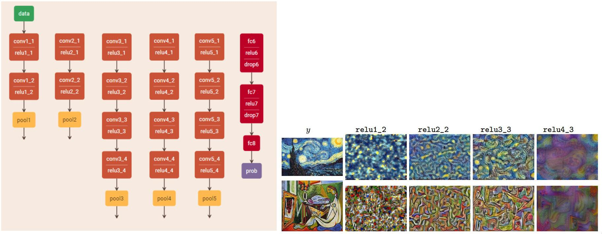

In right fig, y is the data (input) in left fig. Note that relu1_2 is acutally a cube (64 dimension rather than 3 dim as in a orinary figure), but we can plot it. From the right fig, we can see indeed that VGG learns the texture of a figure.

We can also realize it ourselves with the help of [Pytorch tutorial](https://pytorch.org/tutorials/advanced/neural_style_tutorial.html).
However, there are many tricks and strange codes in it. Thus I don't pay time looking at it.

## Fast-style-transfer
### Usage
#### Requirement
`pip install --trusted-host pypi.python.org moviepy`

type `python`, `import imageio` then `imageio.plugins.ffmpeg.download()`. See [here](https://github.com/lengstrom/fast-style-transfer/issues/129)

#### Evaluation
We have downloaded (learned) sevral `ckpt` files (in ckpts folder) which we can use directly. In styles folder, we can see what these styles are. These ckpt files is the learned weights of Transform Net.

`cd C:\Users\kanny\Desktop\playground\fast-style-transfer`

`python evaluate.py --checkpoint ckpts\la_muse.ckpt --in-path contents\fhr.jpg --out-path outputs\fhr_la_muse.jpg`

One figure in 3 seconds. Fast, nearly real-time.

Also, there is a [website](https://tenso.rs/demos/fast-neural-style/) for us to run the evaluation online.

#### Train
If I want to train my own style, I first need to download a 12GB file COCO dataset (figures) and then train for around 4 month (but 4 hours on a Maxwell Titan X).

`python style.py --style styles\shinkai0.jpg --checkpoint-dir checkpoints --test contents\building.jpg --test-dir test_directory --content-weight 1.5e1 --checkpoint-iterations 100 --batch-size 1`

Too long a time for my poor laptop.

### Theoretical concepts
Rather than learning input which is a generative model, we turn into a supervised model (learning weights). Thus, it takes more time in training step but is real-time in test step.

First, we fix a style figure. The input is a figure (from train 2014 dataset). Each time we put input figure into a Transform Net, we get output of the same size (also is a 3D cube figure). The weights of Transform Net is learnable. **We treat Transform_net_output as the desired output.** Now is the same as neural-style model: we put output, content, style into VGG and get LOSS function. We update weights to minimize the LOSS.

Thus, for every style, we learn a Transform Net. (If input fixed, the loss should also fixed)

Transform Net:

1. Eschew pooling layer and use fractionally strided conv layer. Reason: conv layer is more smooth and can learn its own function (by diferrent weight).
2. Use residual blocks. Reason: residual blocks can learn identify function (we indeed want some identifications between output and input).
3. All conv layers are followed by batch normalization + RELUE.
4. downsample(stride 2) + upsample(stride 1/2) in conv layer. Reason: save computations (compared with conv layer of stride 1). have deeper receptive field sizes.
5. In the last layer, we use scaled tanh to turn the output in [0,255].
5. Use L-BFGS (qausi-Newton) to update. Also, we can use Adam, which is faster.

LOSS = content + style + TV (Total Variation Regularization).

We can see this model in a easy way. If we forget VGG net, we use a Network to get output and compute LOSS (**very typical deep learning unreasonable thoughts**): pixel-difference of output and style. However, pixel-difference cannot handel semantic and Perceptral things (eg: if move a figure one pixel up, pixel loss is high). Luckily VGG can represent some Perceptral of a figure. 

It is called Perceptual LOSS. It shows clearer(higher resolution) output compared with MSE because mean is the average, will blur the picture.

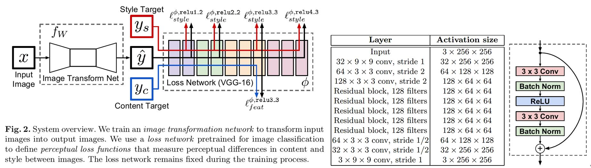

In left fig, input figure is the same as content figure. In middle fig is the structure of Transform Net. In right fig is the residual block.

Finally, thanks to the real-time, we can make videos.

Here we transformed every frame in a video, then combined the results. [Click to go to the full demo on YouTube!](https://www.youtube.com/watch?v=xVJwwWQlQ1o) The style here is Udnie, as above.
<div align = 'center'>
     <a href = 'https://www.youtube.com/watch?v=xVJwwWQlQ1o'>
        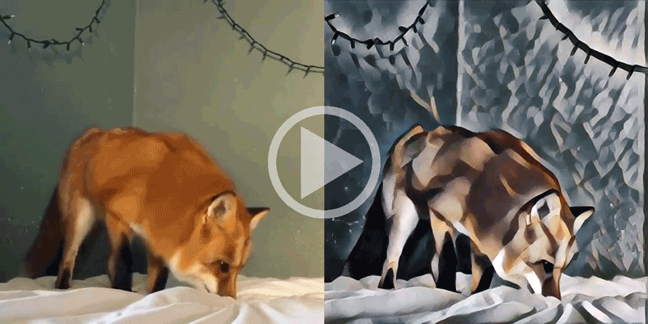
     </a>
</div>

See how to generate these videos [here](#stylizing-video)!

## Shell
Shell (bash) is really useful and convenient. However I am using windows... 

First I download [Cygwin](https://www.cygwin.com/). In the installatin, I choose to add `bash`. Finally, I get a desktop: Cygwin64 Terminal.

Now I can use `pwd` `ls` `mkdir` `echo`.

```
cd /cygdrive/c/Users/kanny/Desktop/playground/shell
bash test.sh
```

We can choose different arguments.

```
cd /cygdrive/c/Users/kanny/Desktop/playground/fast-style-transfer
bash test.sh fhr la_muse
```

Also, we can use `do` as for loop. See `test2.sh` in fast-style-transfer directory.

Also, we can download files easily.

```
cd /cygdrive/c/Users/kanny/Desktop/playground/pytorch-CycleGAN-and-pix2pix
bash ./scripts/download_cyclegan_model.sh summer2winter_yosemite
bash ./datasets/download_cyclegan_dataset.sh summer2winter_yosemite
```
## Pytorch-CycleGAN-and-pix2pix

### Datasets
All avaiable [datasets](https://people.eecs.berkeley.edu/~taesung_park/CycleGAN/datasets/) and avaiable pretrained [models](http://efrosgans.eecs.berkeley.edu/cyclegan/pretrained_models/)

We can for example train VanGogh2photo, that is, trainA is all VanGogh's paintings and trainB is ordinary photos. CycleGan can transform photo to VanGogh type.

### Test
Download pretrained weights and datasets in cygwin. Will automatically make directory: checkpoints\summer2winter_yosemite_pretrained\latest_net_G.pth and datasets\summer2winter_yosemite\data.jpg

```
cd /cygdrive/c/Users/kanny/Desktop/playground/pytorch-CycleGAN-and-pix2pix
bash ./scripts/download_cyclegan_model.sh summer2winter_yosemite
bash ./datasets/download_cyclegan_dataset.sh summer2winter_yosemite
```
Then we begin to test. dataroot is the test_input, it could contain many pictures. name is the location of pth file. The output is automatically in results\summer2winter_yosemite_pretrained\test_latest\images.

```
cd C:\Users\kanny\Desktop\playground\pytorch-CycleGAN-and-pix2pix
python test.py --dataroot datasets/summer2winter_yosemite/mytest --name checkpoints\summer2winter_yosemite_pretrained --model test --no_dropout
```

### Train
- Download data, seprerate to 2 folders: trainA & trainB
- Train a model

```
cd C:\Users\kanny\Desktop\playground\pytorch-CycleGAN-and-pix2pix
# start the visdom server before starting the training; You can also disable the visdom by setting --display_id 0. See Q&A for details
# python -m visdom.server
python train.py --dataroot ./datasets/emojis --name emojis_cyclegan --model cycle_gan --display_freq 50 --niter 1 --display_id 0 --batch_size 3 --loadSize 16 --fineSize 16 --gpu_ids -1
```

- Several important params in training:

1.         parser.add_argument('--display_freq', type=int, default=400, help='frequency of showing training results on screen')
2.         parser.add_argument('--niter', type=int, default=100, help='# of iter at starting learning rate')
3.         parser.add_argument('--lr', type=float, default=0.0002, help='initial learning rate for adam')
4. set --gpu_ids 0,1,2 for multi-GPU mode.
5.         parser.add_argument('--batch_size', type=int, default=1, help='input batch size')
6.         parser.add_argument('--loadSize', type=int, default=286, help='scale images to this size')
7.         parser.add_argument('--fineSize', type=int, default=256, help='then crop to this size')

- Failed

The above code fails.
UserWarning: Palette images with Transparency expressed in bytes should be converted to RGBA images 'to RGBA images').

I need to change data loader in order to read png files. See [here](https://github.com/junyanz/pytorch-CycleGAN-and-pix2pix/issues/321) and Q&A.

## Progressive-growing-GAN
ProGAN is the state-of-art high resolution GAN. [Here](https://blog.csdn.net/liujunru2013/article/details/78545882) is the Chinese translation.

The code is hard for me to understand and it takes too long time to train, thus I don't fork the code here. However, we can take a look and use some pretrained model to generate high resolution face or plane figures.

[ICLR 2018 slides (`karras2018iclr-slides.pptx`)](https://drive.google.com/open?id=1jYlrX4DgTs2VAfRcyl3pcNI4ONkBg3-g) is very concise and readable.

### Theroy
If we use vanilla GAN to construct high resolution, it can't converge because of mode collapse.

#### Mode collapse
Real-life data distributions are multimodal. For example, in MNIST, there are 10 major modes from digit ‘0’ to digit ‘9’. If generator only generates digit '6', it is called mode collapse.

Mode collapse is when the generator generates a limited diversity of samples, or even the same sample, regardless of the input.

This means there exists a single fixed point that the generator thinks is the most optimal point to generate regardless of whatever input noise we feed it.

#### Structure
The key idea is to grow both the generator and discriminator progressively: starting from a low resolution, we add new layers that model increasingly fine details as training progresses.

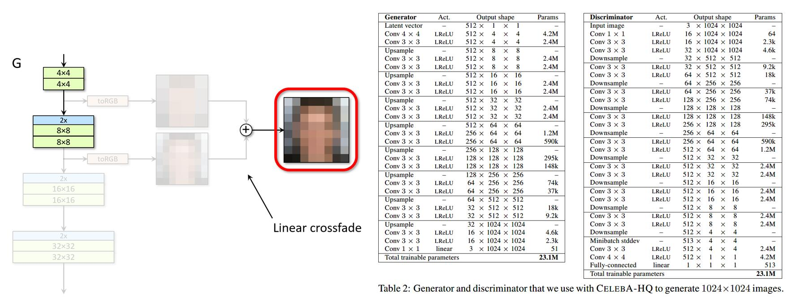

Right fig is the final model structure. Generator input is a random noise of 512, output is 1024\*1024.

Left fig is a step called `fade in`. We treat the layers that operate on the higher resolution like a residual block. `2*` is using nearest neighbor filtering to double size while `0.5*` is average pooling. `toRGB` represents a layer that projects feature vectors to RGB colors, which is 1\*1 conv layer. `fromRGB` is also.

Let's look close to Left fig, we have low resolution fig and then double size, finally add with high resolution fig. Progressive.

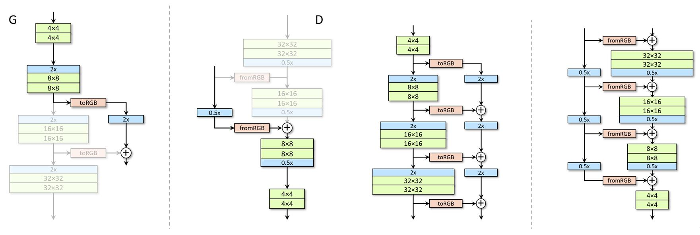

Left left figure is the same, while left right is Discriminator. Right fig is the final model. Note that there are two ouputs in right left: the right one is the correct output.

#### Minibatch discrimination
Inspired by paper: Improved techniques for training GAN, we add a layer: MBStdev (minibatch stand deviation) in Discriminator.

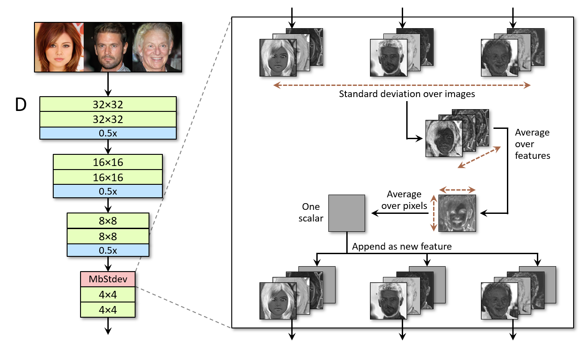

## Image to image with CGAN (pix2pix)
It can realize edge -> photo; day -> night; label -> facade. The aim is quite similar with CycleGAN.

The Chinese translation version is [here](https://blog.csdn.net/qq_16137569/article/details/79950092).

### Objective
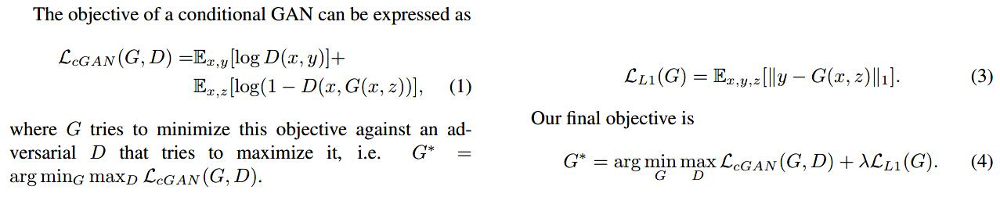

Use L1 norm rather than L2 because L1 encourages less blurring. (the best result under MSE (L2) is mean of inputs, which are less sharp)

In initial experiments, we did not find this strategy effective – the generator simply learned to ignore the noise z.

Instead, for our final models, we provide noise only in the form of dropout, applied on several layers of our generator at both training and test time.

### Generator (encoder-decoder with skips; U-Net)
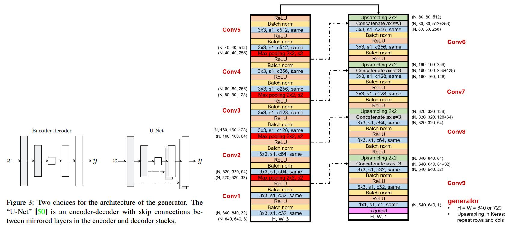

Input of G is (z,edge fig), however, as stated above, we don't use z. Output is photo. The dash line is skip connection which we concate at the channel dimension.

### Discriminator
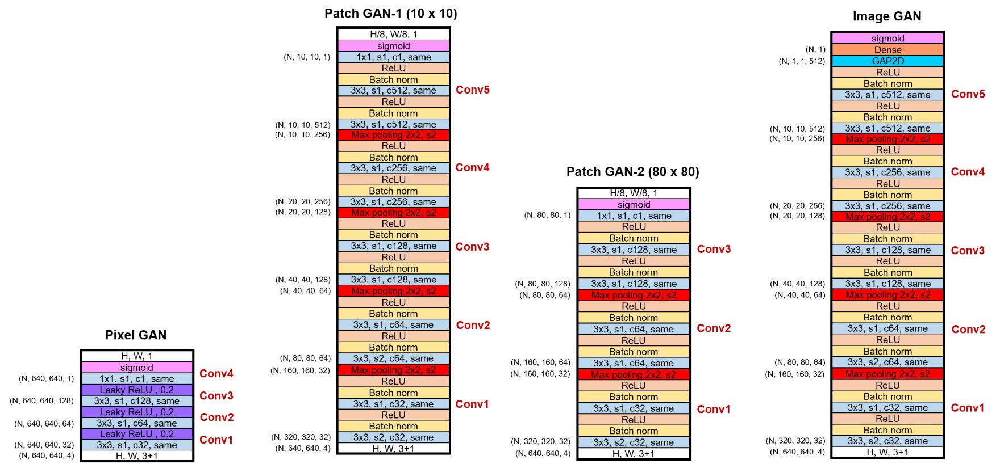

Input of D is (edge fig, (real/fake) photo), output is a scalar for ImageGAN (which is original). We first concate the two inputs at the channel dimension. Then we introduce PatchGAN.

In order to model high-frequencies, it is sufficient to restrict our attention to the structure in local image patches. Therefore, we design a discriminator architecture – which we term a PatchGAN – that only penalizes structure at the scale of patches. 

This discriminator tries to **classify if each N\*N patch in an image is real or fake**. We run this discriminator convolutionally across the image, averaging all responses to provide the ultimate output of D.

For N=1, it is called PixcelGAN, which Discriminator discriminate from every pixcel and then average.

we demonstrate that N can be much smaller (eg: N=10) than the full size of the image and still produce high quality results. 

Such a discriminator effectively models the image as a **Markov random field**, assuming independence between pixels separated by more than a patch diameter. 

The TF code using exactly what G&D in the above figs can be found [here](https://github.com/junyanz/pytorch-CycleGAN-and-pix2pix).

### Evaluate model
While quantitative evaluation of generative models is known to be challenging, we have tried using pre-trained semantic classifiers
to measure the discriminability of the generated stimuli as a pseudo-metric. 

The intuition is that if the generated images are realistic, classifiers trained on real images will be able to classify the synthesized image correctly as well. 

That is [**FCN-8s**](https://arxiv.org/pdf/1605.06211.pdf) architecture.

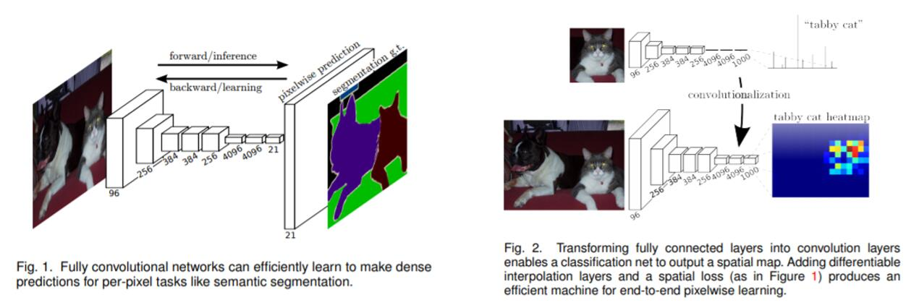

FCN is used as semantic segmentation. See fig2, we change fully-connected layer in vgg16 into convolutional layer.

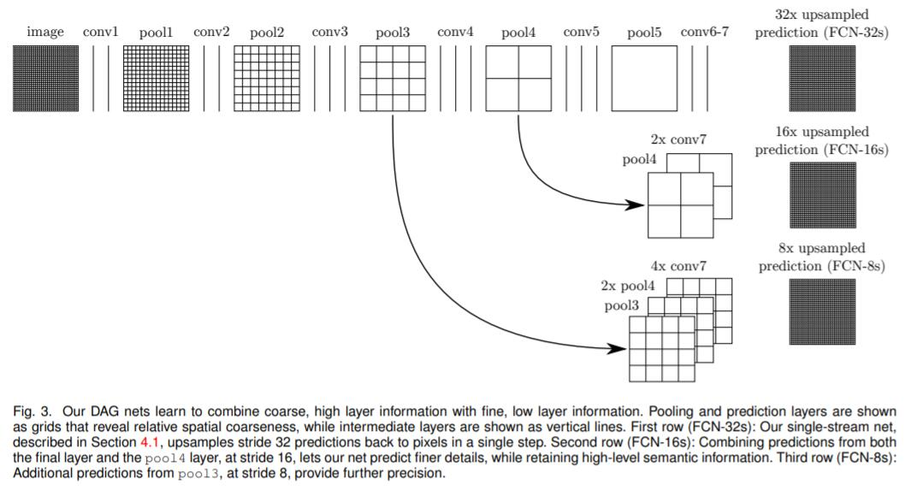

Finally, we upsample to the image size.

## Deepfake
Given many photos of A and B. In test step, we are given a video of A. Deepfake can transform into a video of B. See [here](https://v.qq.com/x/page/q0642apt86a.html) for amazement. We can regard as **face transplanting**.

Hilarie and Trump:

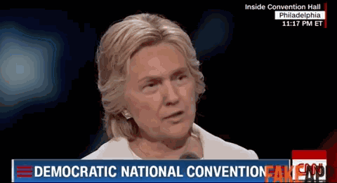

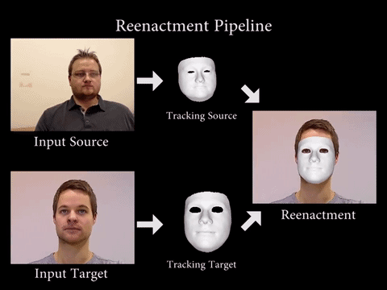

The still updating fantastic github page is [here](https://github.com/deepfakes/faceswap). However, it contains so many different models and even a GUI is allowed. Thus, for clearity, we may take a look at [here](https://github.com/joshua-wu/deepfakes_faceswap).

### Theory
How to realize that? We have to do these five steps.
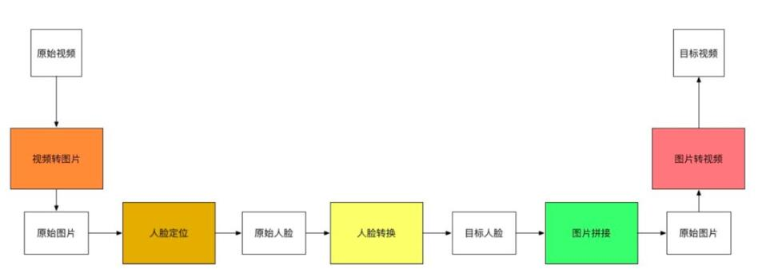

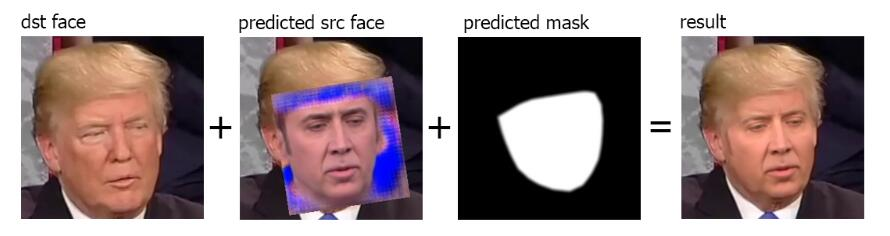

#### video2pics
We use FFmpeg to transfer. Turn a video into many many fix rate pictures.

    ffmpeg -i clipname -vf fps=framerate -qscale:v 2 "imagename%04d.jpg"

#### face location
We turn a photo into face. We use `dlib` library. It is based on HOG method. We can use 68 points to label a face.
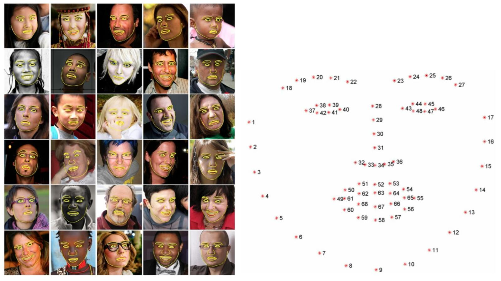

It is defined in `extract.py` to extract faces (in \data folder) from photos. If face not detected, it will rotate the photo.

We need to do alignment (make face horizontal and vertical) and crop photo into faces. The information is saved in `alignments.json` which is used at test step to convert photos.

#### face transformation
We use encoder decoder to realize it. Suppose X=AUB, A,B is the faces. We learn encoder from all of the data (encoder is the universality of all the faces). Decoder learns specific person. Note that we use `PixelShuffler()` function to add distortion to the figure (because direction of faces may vary).

```python
X' = Decoder(Encoder(Shuffle(X)))
Loss = L1Loss(X'-X)

A' = Decoder_A(Encoder(Shuffle(A)))
Loss_A = L1Loss(A'-A)

B' = Decoder_B(Encoder(Shuffle(B)))
Loss_B = L1Loss(B'-B)

fakeB=Decoder_B(Encoder(testA))
```

It is done in `train.py` and `Trainer.py`

#### Convert faces
`convert.py` to put our result (fakeB) in testA.

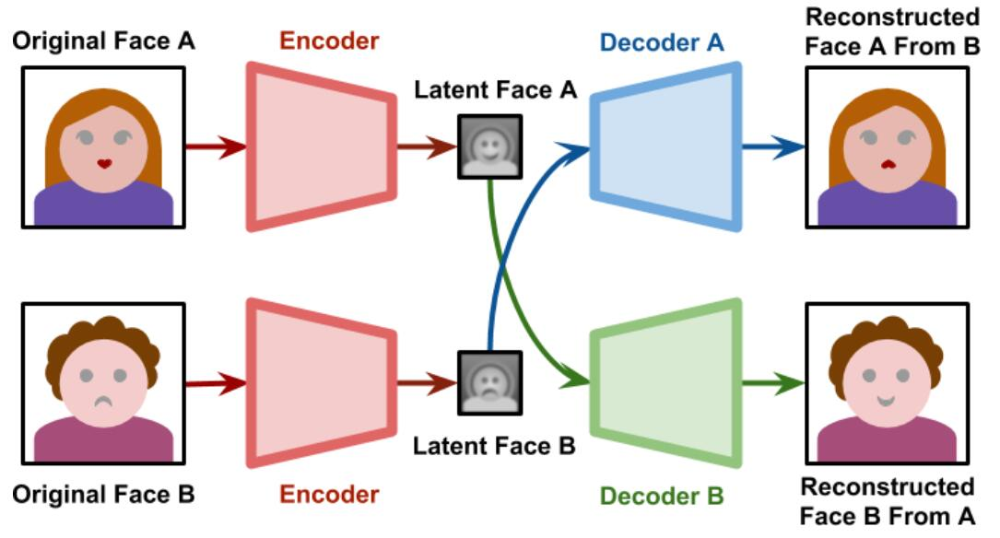

#### Model structure
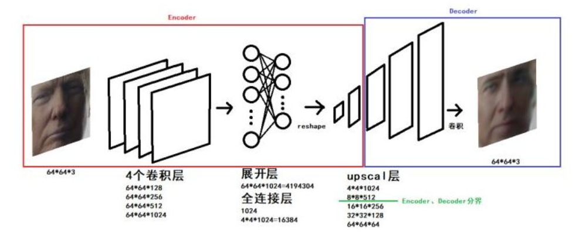

### Setup
See the official very clearly [installation](https://github.com/deepfakes/faceswap/blob/master/INSTALL.md).

For windows, I need to download exactly Microsoft Visual Studio 2015 from https://go.microsoft.com/fwlink/?LinkId=532606&clcid=0x409
(just follow the above official setup).

```
cd C:\Users\kanny\Desktop\playground\deepfakes\faceswap
python setup.py
```
The above code will download used packages for us automatically.

### Usage
Note that since the pretrain model is too big, I don't put it in the repository. You can download at https://anonfile.com/p7w3m0d5be/face-swap.zip.

Also, since the original github repository is updating everyday, we can clone and pull the original one rather than my currently-forking one. However, what are different is models, photo, data, output directories.

See the official [usage](https://github.com/deepfakes/faceswap/blob/master/USAGE.md).

#### Extract
First we need to get photos of A and B. Suppose in the directory: photo\trump, photo\cage.

```
python faceswap.py extract -h
# To convert trump:
python faceswap.py extract -i photo\trump -o data\trump
```
The above extract photos into faces (subset of photos: recognize face landmarks and crop the image) into data\trump, data\cage samely.

#### Train
We specify the folders where the two faces are, and where we will save our training model. Take long time.

```
python faceswap.py train -h
python faceswap.py train -A data\trump -B data\cage -m models\
```

#### Convert
Now that we're happy with our trained model, we can convert our video. How does it work? Similarly to the extraction script, actually! The conversion script basically detects a face in a picture using the same algorithm, quickly crops the image to the right size, runs our bot on this cropped image of the face it has found, and then (crudely) pastes the processed face back into the picture.

```
python faceswap.py convert -h
python faceswap.py convert -i photo\trump -o output\ -m models\

Error: Alignments file not found at C:\Users\kanny\Desktop\playground\deepfakes\faceswap\photo\trump\alignments.json
```
`alignments.json` is created in the `extract` step, which indicates, for each aligned frame, its original position in the image from which it was extracted. So it is used in the `convert` step.

Finally, we do color correction.

#### Pre-trained model
A pre-trained model is not required, but you can download the following pre-trained Cage/Trump training model. It contains faces of Trump and Cage and 2 decoder & 1 encoder.

Whole project with training images and trained model (~300MB): https://anonfile.com/p7w3m0d5be/face-swap.zip.

My try:

The faces data is acutally of no use. We use `.h5` files and suppose they are in directory: faceswap\models\.

Then I download some Trump photo from google and in directory: faceswap\photo\trump.

```
cd C:\Users\kanny\Desktop\playground\deepfakes\faceswap
python faceswap.py extract -i photo\trump -o data\trump -D dlib-hog -A dlib
python faceswap.py convert -i photo\trump -o output\ -m models\
```

### FakeApp
FakeApp is a silly software for all people to use easily. [Here](https://www.alanzucconi.com/2018/03/14/how-to-install-fakeapp/) to see how to install and use.

### Tips

1.Reusing existing models will train much faster than starting from nothing.
If there is not enough training data, start with someone who looks similar, then switch the data.

2.Split frames based on face orientation and train different models. (Because rotating faces is also very challenging)

All of the below tricks are [here](https://github.com/shaoanlu/faceswap-GAN).

3.Use GAN instead of AutoEncoder.

4.Add perceptual loss (with the help of VGG, see fast neural style).

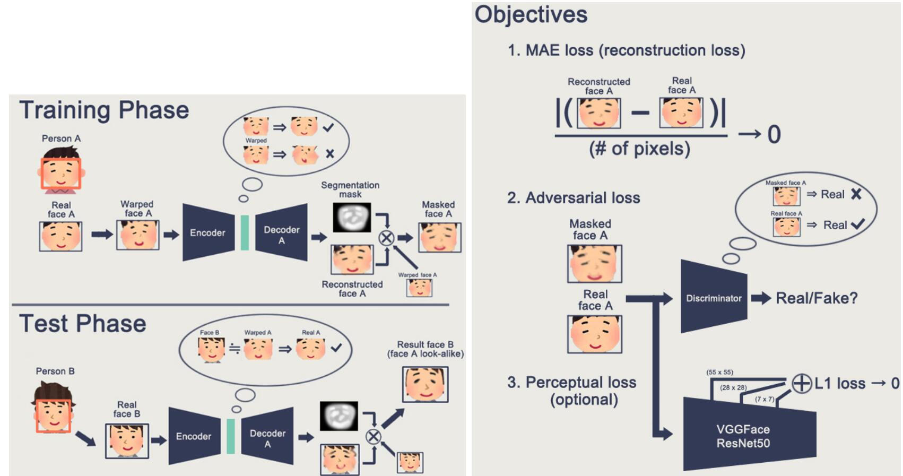

Here we warped the picture to add noises.

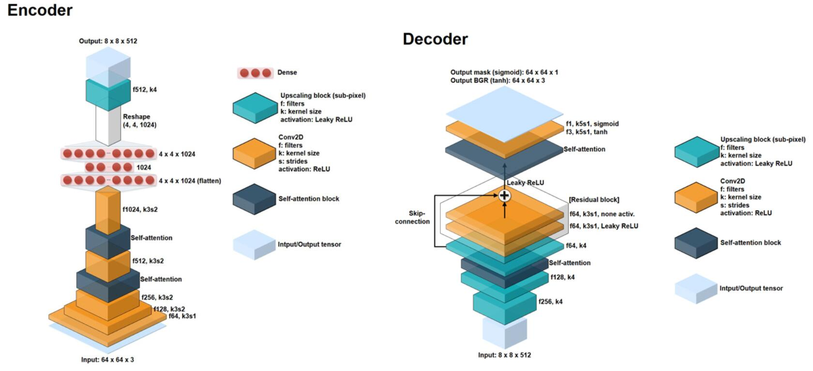

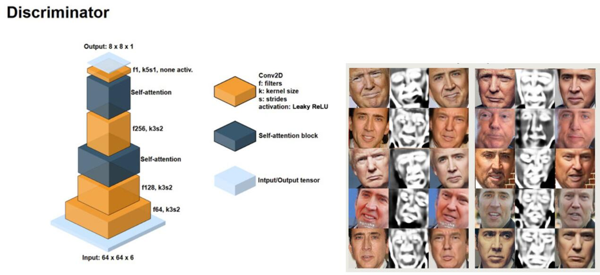

5.Use attention. Attention mask: Model predicts an attention mask that helps on handling occlusion, eliminating artifacts, and producing natrual skin tone. In below are results of Emi Takei (武井咲).


## DanQ
I don't fork DanQ because the original github page is realized by keras. The reason I write DanQ here is because it combines CNN and RNN.

DanQ: a hybrid convolutional and recurrent deep neural network for quantifying the function of DNA sequences.

The convolution layer captures regulatory motifs, while the recurrent layer captures long-term dependencies between the motifs in order
to learn a regulatory ‘grammar’ to improve predictions. This weightsharing strategy is especially useful for studying DNA because
the convolution filters can capture sequence motifs, which are short, recurring patterns in DNA that are presumed to have a biological function. 

Input: an obeservation: 1000 DNA sequence, each is a number (1,2,3,4) representing (A、T、C、G). We turn into [4,1000] onehot matrix [input,seq].

Output: a [919] vector, each is binary (0/1). 919 chromatin features; a chromatin feature was labeled 1 if more than half of the 1000-bp bin is in the peak region and 0 otherwise.

### Model structure
CNN: 1D CNN, input [4,1000] => 320@ kernel size: [4,26] => [320,1000-26] => Relu+maxpooling [320,n] (suppose n=500).

RNN: Bidirection LSTM: input [320,500] [seq=500, batch=1, input_dim=320] => hidden:[seq=500, batch=1, hid_dim=320].

Flatten+Fully connected+RELU => [919] => element wise sigmoid function [919]. Each number is a probability that this output is 1.

We use RMSprop to update and multi-task binary cross entropy loss function.

### DNA motifs
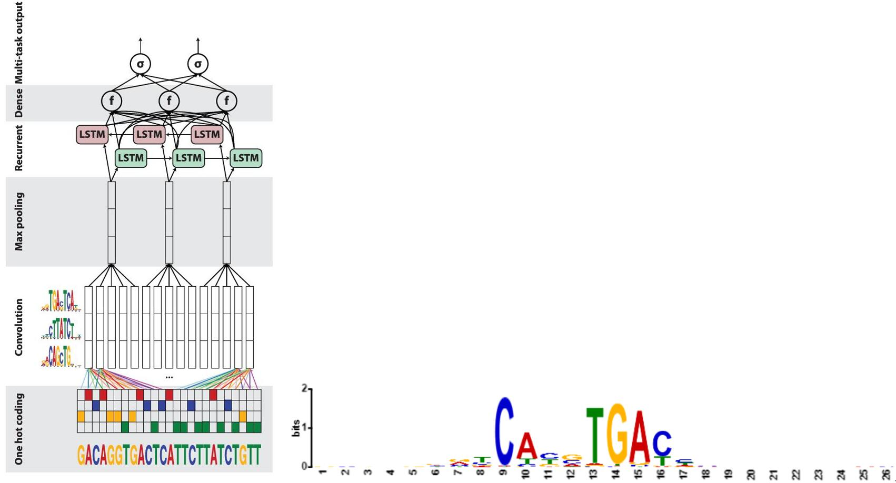

The left fig is model structure and right fig is motifs.

These 320 learned kernels [4,26] can be viewd as motrifs. Indeed, more than a half of the kernels is aligned to known motifs. We plot motifs' logo, where logo bigger means corresponding value is bigger in this matrix.

Also, since weight initialization is known to play crucial role for the performance neural networks, we initial some of the weights at known motifs and get better result.
